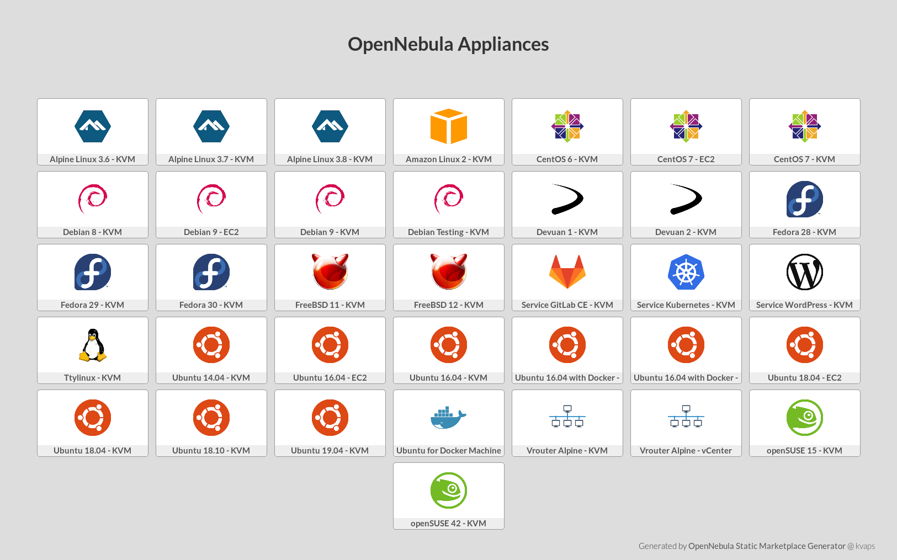

# OpenNebula Static Marketplace

## Description

Generate your own marketplace appliances statically.

## Demo

[](https://raw.githack.com/kvaps/addon-appmarket-static/master/public/index.html)

## Features

* Build your own marketplace
* Store your configuration in git
* Share virtual appliances across several OpenNebula instances
* Tight integration with OpenNebula

## Development

To contribute bug patches or new features, you can use the github Pull Request model. It is assumed that code and documentation are contributed under the Apache License 2.0. 

More info:
* [How to Contribute](http://opennebula.org/addons/contribute/)
* Support: [OpenNebula user forum](https://forum.opennebula.org/c/support)
* Development: [OpenNebula developers forum](https://forum.opennebula.org/c/development)
* Issues Tracking: Github issues

## Author

* Author: [kvaps](http://github.com/kvaps)

* Images metadata imported automatically from official [OpenNebula Marketplace](http://marketplace.opennebula.systems/) and managed by [OpenNebula Systems](http://opennebula.systems/).

## Compatibility

This add-on is compatible with OpenNebula 4.14.2+

## Driver Installation

Driver installation:

```
git clone https://github.com/kvaps/addon-appmarket-static
cp -r addon-appmarket-static/driver/static /var/lib/one/remotes/market/
```

Update `/etc/one/oned.conf`:

Add `static` into `MARKET_MAD` argumets:

```
MARKET_MAD = [
    EXECUTABLE = "one_market",
    ARGUMENTS  = "-t 15 -m http,s3,one,static"
]
```

After that create a new `TM_MAD_CONF` section:

```
MARKET_MAD_CONF = [
    NAME = "static",
    SUNSTONE_NAME  = "Statically Generated Marketplace",
    REQUIRED_ATTRS = "",
    APP_ACTIONS = "monitor",
    PUBLIC = "yes"
]
```

## Driver configuration

The following attributes can be used for configure marketplace

|    Attribute        |                     Description                |
| ---------------     | ---------------------------------------------- |
| `NAME`              | The name of the marketplace                    |
| `ENDPOINT`          | URL to your metadata file                      |
| `MARKET_MAD`        | Must be `static`                               |
| `BRIDGE_LIST`       | List of hosts used for downloading metadata    |


Create new marketplace:

```
cat > appmarket.conf <<EOT
NAME = "Static Marketplace"
MARKET_MAD = "static"
ENDPOINT = "https://github.com/kvaps/addon-appmarket-static/raw/master/public/metadata/index.html"
EOT

onedatastore create market.conf
```

## Usage 

For creating your own marketplace:

1. Install [Hugo](https://github.com/gohugoio/hugo)

2. Clone this repo

3. Remove default appliances

   ```
   rm -rf ./data/appliances/*
   ```

4. Describe your appliance using yaml sytax and save it into `data/appliances/myapp.yaml`

5. Generate new site

   ```
   hugo
   ```

6. Upload generated site from `public/*` or just metadata `public/metadata/index.html` to some HTTP or S3-storage and provide access to it

7. Specify url in `ENDPOINT` variable to the static marketplace driver in OpenNebula
